# CMake不正经教程：C++全平台环境配置
全平台配置c++的编译环境，以及CMakeLists.txt的编写的入门教程，特别声明，本人C++小白，之所以会写下这个教程，一个是自己前面做视频说要做这个，另外就是对于一个小白而言，真正一步步的视频真的不多，虽然人生需要悟性，但是悟还是需要时间的。我就把我学习的过程分享出来，希望对和我一样的菜鸟有一丝丝的帮助，也随时可以让我回忆起来之前的知识。

>编程这东西，说白了就是熟能生巧，不写学不会，不用忘得快。

Windows和Macos是VSCode + Cmake插件，Linux是LunarVim + Neovim-CMake进行。本教程的主要环境是Linux，不同平台不影响学习效果。除环境配置以及打包两个步骤，其他步骤都是在Linux上完成。

>:exclamation: 版权声明：转载时请注明作者GAMEOMETRICS，并标注原文链接[https://github.com/GAMEOMETRICS/CMakeTutorial](https://github.com/GAMEOMETRICS/CMakeTutorial)。

>看我多正经，都有版权声明。

本教程主要是基于CMake的C++编程环境构建，只会对CMake最常用命令有所涉及，其他不常用命令可以自行搜索，最终的效果就是可以看懂大部分的CMakeLists.txt，引入外部库等。

第2 3 4部分的示例流程参考官方文档，不保证一样或者说保证不太一样，官方教程的链接为[https://cmake.org/cmake/help/latest/guide/tutorial/index.html](https://cmake.org/cmake/help/latest/guide/tutorial/index.html)，中文版[https://juejin.cn/post/6844903557183832078](https://juejin.cn/post/6844903557183832078)(这个是我找到写的比较清晰的一个版本，官方教程没有中文版本)，官方教程的github代码地址为[https://github.com/Kitware/CMake/tree/master/Help/guide/tutorial](https://github.com/Kitware/CMake/tree/master/Help/guide/tutorial)。

本教程会有同步视频录制，并上传至bilibili平台，有兴趣的请关注我的bilibili账号[GAMEOMETRICS](https://space.bilibili.com/282638845)，观看[视频合集](https://www.bilibili.com/video/BV13M4y1Q7Dt/?vd_source=0bad5983f48e222f822fa753e9a651f9)。

>本教程录制时间2023年2月

>你的俩硬币和一键三连和分享，我要定了！！！。

## 1 编辑器及插件安装
环境配置分三个平台分别进行，包括Windows、Macos和Linux。本人主力编程环境是Linux，Windows和Macos两个环境的配置会在整个教程结束后进行录制，不同的环境不影响学习`CMake`的效果。如果你是Windows或者Macos，请自行跳转到1.2和1.3节。

>其实你可以看一下我在Linux上是如何尴尬的。

### 1.1 Linux 
本人使用的Linux环境是Manjaro系统，所有的环境配置以及命令都以该环境为主，如果你是Linux其他的发行版本，请搜索对应的安装命令，本教程用到的工具都是常用工具，基本不存在下载不到的情况。
#### 1.1.1 cmake的安装
在Manjaro中首先安装最基本的编程环境，然后安装cmake工具。
```bash
sudo pacman -S base-devel
sudo pacman -S cmake
```
这一步最重要的就是安装gcc make cmake等等环境。

>人生啊，不仅有意外的收获，更多的是收获意外。

#### 1.1.2 LunarVim的安装

从这一步开始最好是能够科学上网，如果不行下载一个`vscode`只是插件会少很多，并且插件质量和`window`以及`macos`的天差地别。
```bash 
sudo pacman -S code
```
可以使用上述命令自行体会一下，也可以看我的[VSCode失败的尝试](https://www.bilibili.com/video/BV1uD4y1P74k/?vd_source=0bad5983f48e222f822fa753e9a651f9)。

如果你能科学上网，那么首先你需要安装neovim,
```bash
sudo pacman -S neovim
```
然后根据[LunarVim](https://www.lunarvim.org/zh-Hans/docs/installation)的下载方式进行安装，关于LunarVim的配置不再展开。

>如果你是一个高手相信你有自己的`neovim`的配置，如果你是和我一样的菜鸟，听哥一句劝，安装一个`LunarVim`就可以了，别打肿脸充胖子去搞`NeoVim`，耗费的时间够你学会python和C++好几次了。

看我的视频就知道了，配置是最困难的一件事情，在windows和mac上最幸福的就是有很多好用的编辑器。

#### 1.1.3 编辑器插件安装

##### 1.1.3.1 c++插件安装
在安装好编辑器之后，我们需要对C++环境(高亮、语法、错误检查)进行安装，VSCode中使用`CppTools`就可以了(Linux里面没有，不要想了)，LunarVim则需要使用已经自带的`Mason`工具对`LSP`的一些环境进行配置，主要包括四类：
    
    * LSP 自动补全、转到定义、文档等等
    * DAP 调试功能
    * Linter 错误检查
    * Formatter 格式化代码

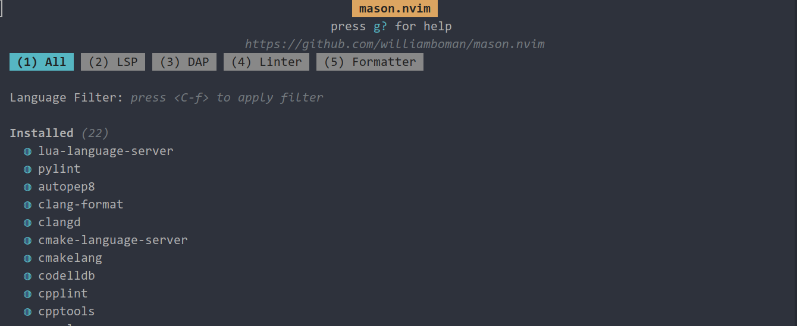
在不同的类别分别找到对应的插件，按`i`进行安装。

>不要问为什么，问就是我也不知道。

##### 1.1.3.2 cmake插件安装
在LunarVim中需要下载和配置[neovim-cmake](https://github.com/Shatur/neovim-cmake)插件，在LunarVim的配置文件中`~/.config/lvim/config.lua`中找到以下代码，并添加`neovim-cmake`插件。
```lua
lvim.plugins = {
    {
        'stevearc/dressing.nvim'
    },
    {
        'shatur/neovim-cmake'
    },
}
```
然后根据github，在`~/.config/lvim`文件夹下建立文件夹目录`mkdir -P lua/lvim/cmake`，并新建一个`neovim-cmake.lua`文件，将以下配置填入：
```lua
local Path = require('plenary.path')
progress = ''
require('cmake').setup({

    cmake_executable = 'cmake', -- CMake executable to run.
    save_before_build = true, -- Save all buffers before building.
    parameters_file = 'build/neovim.json', -- 这里可以改成你想要的地址和名字，配置文件
    build_dir = tostring(Path:new('{cwd}', 'build', '{os}-{build_type}')), -- Build directory. The expressions `{cwd}`, `{os}` and `{build_type}` will be expanded with the corresponding text values. Could be a function that return the path to the build directory.
    default_parameters = { args = {}, build_type = 'Debug',
        run_dir = tostring(Path:new('{cwd}', 'build', '{os}-{build_type}')), dap_configurations = 'cppdbg_vscode' }, -- The default values in `parameters_file`. Can also optionally contain `run_dir` with the working directory for applications.
    -- samples_path = tostring(script_path:parent():parent():parent() / 'samples'), -- Folder with samples. `samples` folder from the plugin directory is used by default.
    default_projects_path = tostring(Path:new(vim.loop.os_homedir(), 'code/cpp_code/')), -- 这里填入你想要的默认的地址.
    configure_args = { '-D', 'CMAKE_EXPORT_COMPILE_COMMANDS=1' }, -- Default arguments that will be always passed at cmake configure step. By default tells cmake to generate `compile_commands.json`. 注意：这个comple_commands.json对于clangd编译器十分重要，要不然就会出现找不到头文件的情况
    build_args = {}, -- Default arguments that will be always passed at cmake build step.
    on_build_output = function(lines)
        -- Get only last line
        local match = string.match(lines[#lines], "(%[.*%])")
        if match then
            progress = string.gsub(match, "%%", "%%%%")
        end
    end, -- Callback that will be called each time data is received by the current process. Accepts the received data as an argument.
    quickfix = {
        pos = 'botright', -- Where to open quickfix
        height = 10, -- Height of the opened quickfix.
        only_on_error = false, -- Open quickfix window only if target build failed.
    },
    copy_compile_commands = true, -- Copy compile_commands.json to current working directory.
    dap_configurations = { -- Table of different DAP configurations.
        lldb_vscode = { type = 'codelldb', request = 'launch' },
        cppdbg_vscode = { type = 'cppdbg', request = 'launch' },
    },
    dap_configuration = 'cppdbg_vscode', -- DAP configuration to use if the projects `parameters_file` does not specify one.
    dap_open_command = require('dapui').open(), -- Command to run after starting DAP session. You can set it to `false` if you don't want to open anything or `require('dapui').open` if you are using https://github.com/rcarriga/nvim-dap-ui
})
```
> **注意:** *血泪教训* **一定要生成compile_commands.json文件，否则GCC编译器会找不到头文件。请看我视频中大冤种的表现**

在完成上面配置文件构建以后，需要在`config.lua`文件内容引入进来，找一个地方填入
```lua
require('lvim.cmake.neovim-cmake') --最外层的lua文件夹不用引入
```
这样我们的配置文件就可以生效了，这个时候我们的`CMake`已经可以在vim的命令行内使用`:CMake xx`进行调用了。
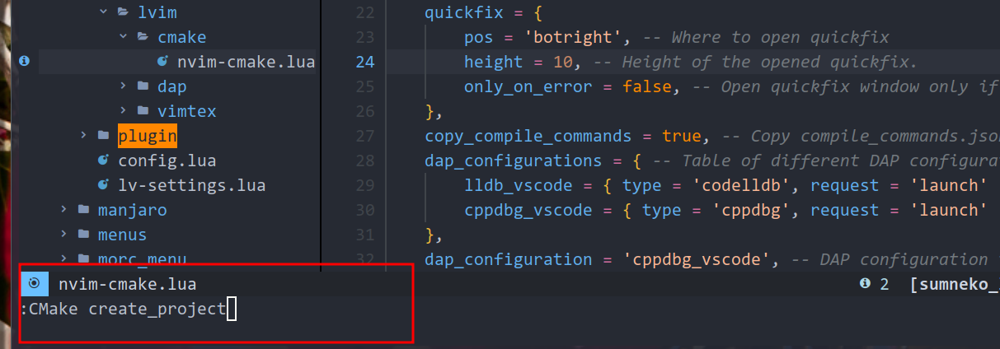
在`neovim-cmake`的github中罗列出了可以使用的命令，在LunarVim中同样可以使用`tab`进行提示，你可以跟着[视频](https://www.bilibili.com/video/BV1z54y1N7tR/?spm_id_from=333.999.0.0&vd_source=0bad5983f48e222f822fa753e9a651f9)熟悉一下操作，也可以继续。

> 现在知道视频的重要性了吗？一键三连，Come on ! ! !

##### 1.1.3.3 Cmake插件的which-key配置及使用
如果使用命令行进行操作的话，操作的繁琐程度和直接在terminal里面输入命令基本是一致的，不会节约我们什么时间，好在LunarVim中集成了一个非常好用的命令行提示工具叫which-key，按下特定的键后，会提示这个键绑定的子命令操作，例如图我们按下`<leader>`:
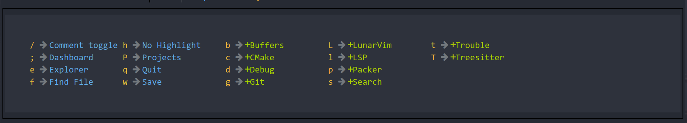
LunarVim配置which-key也十分的简单，只需要在我们的`config.lua`文件内添加以下代码：
```lua
lvim.builtin.which_key.mappings["c"] = {
    name = "CMake",
    n = { "<cmd>CMake create_project<cr>", "New Project" },
    b = { "<cmd>CMake build<cr>", "Build" },
    Ba = { "<cmd>CMake build_all<cr>", "Build All" },
    Bd = { "<cmd>CMake build_and_debug<cr>", "Build and Debug" },
    c = { "<cmd>CMake clean<cr>", "Clean" },
    C = { "<cmd>CMake clear_cache<cr>", "Clear Cache" },
    d = { "<cmd>CMake debug<cr>", "Debug" },
    f = { "<cmd>CMake configure<cr>", "Configure" },
    r = { "<cmd>CMake build_and_run<cr>", "Build and Run" },
    R = { "<cmd>CMake run<cr>", "Run" },
    sa = { "<cmd>CMake set_target_arguments<cr>", "Set Target Argument" },
    sd = { "<cmd>CMake select_dap_config<cr>", "Select DAP Config" },
    t = { "<cmd>CMake select_target<cr>", "Select Target" },
    T = { "<cmd>CMake selet_build_type<cr>", "Select Build Type" },
    o = { "<cmd>CMake open_build_dir<cr>", "Open Build Dir" },
    p = { "<cmd>CMake cancel<cr>", "Pause" },
}
```
上述代码里面`<cmd>CMake xxx<cr>`的字符就是我们在命令行里面打出`:CMake xxx`然后按回车的效果，因此我们可以将neovim-cmake这个插件的所有命令进行快捷键绑定，你可以根据自己的习惯和需求进行更改，最终的效果如下：
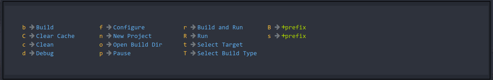
我们按`<leader>c`就会弹出上述快捷按键面板，可以看到有些第一个字母重复的键会有`+`的标志表示还有下一级的快捷键绑定，同时我们可以使用`Backspace`键回到上级菜单。

通过这种方法我们就可以快速的调用CMake命令进行项目的配置和编译了，这种方法和Windows和Macos上的使用效率几乎一样，但是更帅就对了。

>什么都不重要，帅就行了，这就是为什么用Linux的原因？？？

#### 1.1.4 调试环境安装
使用上面的环境基本可以解决大部分情况了，但是LunarVim还是没有DEBUG调试功能，因此我们这一次就是要解决调试功能。
##### 1.1.4.1 插件安装
这一部分我们需要三个插件，分别是`nvim-dap`，`nvim-dap-ui`，`nvim-dap-virtual-text`，将这三个插件在`~/.config/lvim/config.lua`中添加plugin下载就可以了，我们其实只需要下载一个`nvim-dap-virtual-text`就可以了，其他两个`LunarVim`都是自带的。

安装完成之后，我们可以通过`:PackerStatus`查看是否安装成功。
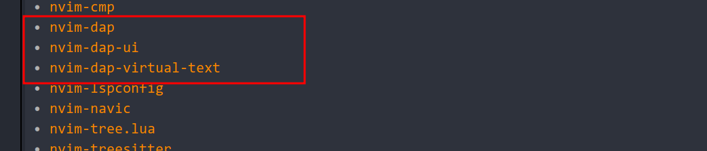
安装之后我们需要对安装的插件进行配置，首先是`dap-virtual-text`的配置，我们在`～/.config/lvim/lua/lvim`下创建文件夹`dap`，然后创建一个`dap-virtual-text.lua`，填入以下配置：
```lua
require("nvim-dap-virtual-text").setup {
    enabled = true, -- enable this plugin (the default)
    enabled_commands = true, -- create commands DapVirtualTextEnable, DapVirtualTextDisable, DapVirtualTextToggle, (DapVirtualTextForceRefresh for refreshing when debug adapter did not notify its termination)
    highlight_changed_variables = true, -- highlight changed values with NvimDapVirtualTextChanged, else always NvimDapVirtualText
    highlight_new_as_changed = false, -- highlight new variables in the same way as changed variables (if highlight_changed_variables)
    show_stop_reason = true, -- show stop reason when stopped for exceptions
    commented = false, -- prefix virtual text with comment string
    only_first_definition = true, -- only show virtual text at first definition (if there are multiple)
    all_references = false, -- show virtual text on all all references of the variable (not only definitions)
    --- A callback that determines how a variable is displayed or whether it should be omitted
    --- @param variable Variable https://microsoft.github.io/debug-adapter-protocol/specification#Types_Variable
    --- @param buf number
    --- @param stackframe dap.StackFrame https://microsoft.github.io/debug-adapter-protocol/specification#Types_StackFrame
    --- @param node userdata tree-sitter node identified as variable definition of reference (see `:h tsnode`)
    --- @return string|nil A text how the virtual text should be displayed or nil, if this variable shouldn't be displayed
    display_callback = function(variable, _buf, _stackframe, _node)
        return variable.name .. ' = ' .. variable.value
    end,

    -- experimental features:
    virt_text_pos = 'eol', -- position of virtual text, see `:h nvim_buf_set_extmark()`
    all_frames = true, -- show virtual text for all stack frames not only current. Only works for debugpy on my machine.
    virt_lines = false, -- show virtual lines instead of virtual text (will flicker!)
    virt_text_win_col = nil -- position the virtual text at a fixed window column (starting from the first text column) ,
    -- e.g. 80 to position at column 80, see `:h nvim_buf_set_extmark()`
}
```
然后对dap进行配置，在上面相同文件夹下面创建`dap-adapter.lua`文件，然后填入以下配置：
```lua
local dap = require('dap')

local cmd = '' ---你的codelldb的地址，这个地址在.local/share/nvim/mason/packages/codelldb/extension/adapter/ 这个文件夹里面，你填入你的绝对路径  
dap.adapters.codelldb = function(on_adapter)
    -- This asks the system for a free port
    local tcp = vim.loop.new_tcp()
    if (tcp == nil) then
        print('nil tcp ....')
        return
    end
    tcp:bind("127.0.0.1", 0)
    local port = tcp:getsockname().port
    tcp:shutdown()
    tcp:close()

    -- Start codelldb with the port
    local stdout = vim.loop.new_pipe(false)
    local stderr = vim.loop.new_pipe(false)
    if (stdout == nil or stderr == nil)
    then
        return
    end

    local opts = {
        stdio = { nil, stdout, stderr },
        args = { "--port", tostring(port) }
    }
    local handle
    local pid_or_err
    handle, pid_or_err =
    vim.loop.spawn(
        cmd,
        opts,
        function(code)
            stdout:close()
            stderr:close()
            handle:close()
            if code ~= 0 then
                print("codelldb exited with code", code)
            end
        end
    )
    if not handle then
        vim.notify("Error running codelldb: " .. tostring(pid_or_err), vim.log.levels.ERROR)
        stdout:close()
        stderr:close()
        return
    end
    vim.notify("codelldb started. pid=" .. pid_or_err)
    stderr:read_start(
        function(err, chunk)
            assert(not err, err)
            if chunk then
                vim.schedule(
                    function()
                        require("dap.repl").append(chunk)
                    end
                )
            end
        end
    )
    local adapter = {
        type = "server",
        host = "127.0.0.1",
        port = port
    }
    -- 💀
    -- Wait for codelldb to get ready and start listening before telling nvim-dap to connect
    -- If you get connect errors, try to increase 500 to a higher value, or check the stderr (Open the REPL)
    vim.defer_fn(
        function()
            on_adapter(adapter)
        end,
        500
    )
end
```
在上述的配置中，需要注意的是cmd的地址的填写。

> 什么？你还不知道DAP怎么下载，在LunarVim的命令行打入`:Mason`，然后在下面选择codelldb按`i`进行安装：
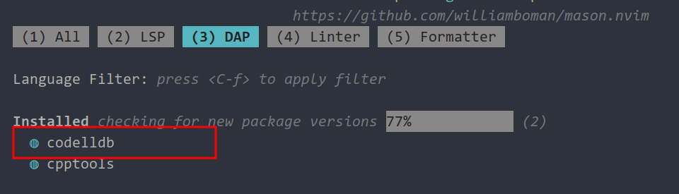

在配置好Adapter之后，还需要再建建一个`dap-cpp.lua`来配置我们c++怎么调用调试，填入以下内容：
```lua
local dap = require('dap')
dap.configurations.cpp = {
    {
        name = 'Launch file',
        type = 'codelldb',
        request = 'launch',
        program = function()
            return vim.fn.input('Path to executable: ', vim.fn.getcwd() .. '/', 'file')
        end,
        cwd = '${workspaceFolder}',
        stopOnEntry = false,
        args = {},

        -- 💀
        -- if you change `runInTerminal` to true, you might need to change the yama/ptrace_scope setting:
        --
        --    echo 0 | sudo tee /proc/sys/kernel/yama/ptrace_scope
        --
        -- Otherwise you might get the following error:
        --
        --    Error on launch: Failed to attach to the target process
        --
        -- But you should be aware of the implications:
        -- https://www.kernel.org/doc/html/latest/admin-guide/LSM/Yama.html
        -- runInTerminal = false,
    },
}

-- If you want to use this for Rust and C, add something like this:
dap.configurations.c = dap.configurations.cpp
dap.configurations.rust = dap.configurations.cpp

```
现在还需要最后一步就是将上述的文件引入到我们的`～/.config/lvim/config.lua`里面去，如下图
```lua
require('lvim.dap.dap-virtual-text')
-- CMAKE的相关配置
require("lvim.dap.dap-adapter")
require("lvim.dap.dap-cpp")
```
到目前为止，我们的环境总算是配置的差不多了，但是也才刚刚开始。

>你是不是已经想要放弃了，嗯，何苦呢，用什么Linux, windows是真的挺香的。

##### 1.1.4.2 Lunar默认的配置修改
在修改了用户自定义的配置之后呢，我们还需要对LunarVim的默认的配置进行修改。

>你也可以在自己的config文件里面进行覆盖，我没有洁癖，嗯，就是懒。

这里需要修改两个文件，这两个文件都在LunarVim的默认配置位置`~/.local/share/lunarvim/lvim/lua/lvim/core/`这个文件下面，首先是`dap.lua`这个文件，我们只需要将以下几行的注释给去掉。
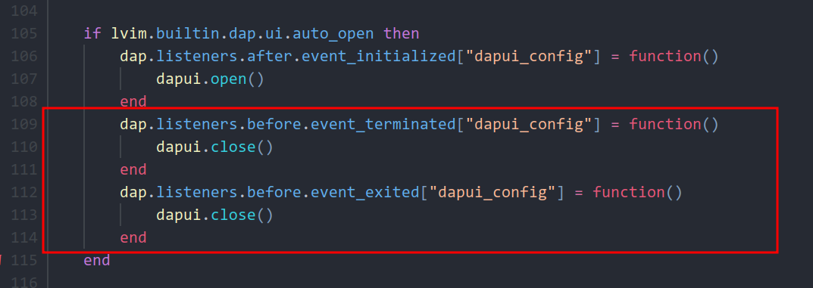
这几行代码主要控制我们在DEBUG结束之后，或者我们按下停止键可以关闭我们的`tab-ui`。

另外一个文件就是同一个文件夹下的`project.lua`，找到下面的一行
```lua 
---@usage patterns used to detect root dir, when **"pattern"** is in detection_methods
patterns = { ".git", "_darcs", ".hg", ".bzr", ".svn", "Makefile", "package.json", "pom.xml", "CMakeLists.txt" },
```
在最后添加`CMakeLists.txt`，这个主要解决nvim-tree在我们项目文件时，自动打开上一级具有`.git`文件的问题，因为我们的`cmake`插件只能在有`CMakeLists.txt`的根目录里面才能正确配置，这个情况请参考[视频](https://www.bilibili.com/video/BV1Ye4y1P7ZN/?spm_id_from=333.999.0.0&vd_source=0bad5983f48e222f822fa753e9a651f9)，文字不太好说清楚。

> 我还有要一键三连的机会吗？我想做个好人。

##### 1.1.4.3 演示
终于到了我们的演示阶段了，使用`cmake`插件创建一个CMake项目，然后在`main.cpp`内添加一些代码，可以copy我git里面最简单的代码，也可以看视频跟着一起写，创建玩项目之后，一定要先对项目进行配置，选择build target，然后进行build。

>DEBUG前一定要BUILD, BUILD, BUILD, 重要的事情说三遍。

然后在某一行打断点，`<leader>->d -> t`这个是LunarVim默认的dap的快捷键配置，然后我们使用CMAKE的编译命令进行编译`<leader>->c->d`，这样我们就看到我们的dapui的界面了，真的是热泪盈眶了。终于出来了。
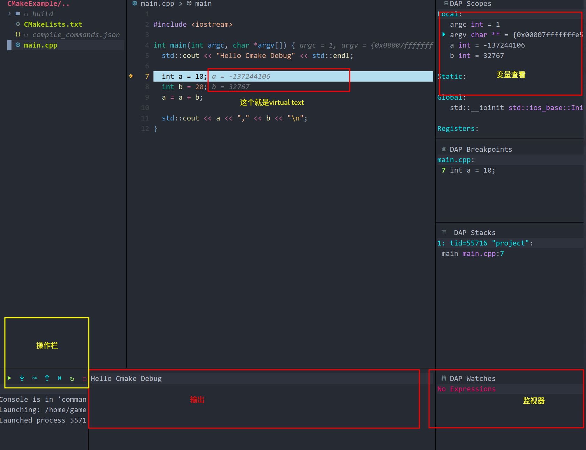
> 我们不一样，我们都一样。

然后使用方法应该都会了吧，实在是录制了两遍，人没了精神，歇了。
 

### 1.2 Windows和Macos的环境和工具配置
windows和macos在基于VSCode+CMake的开发环境是是十分简单和无脑的，可以观看我的[B站视频](https://www.bilibili.com/video/BV13M4y1Q7Dt/?spm_id_from=333.999.0.0&vd_source=0bad5983f48e222f822fa753e9a651f9)，视频中会将`CMake`的安装，`VSCode`需要的插件做一个详细的解释。不同于Linux，这两个平台的配置真的是太友好了，视频中分别会将本教程的两个样例进行运行，以演示环境的可用性。

另外`ImGui`的`main.cpp`在Macos上运行需要格外的注意，需要注意以下代码
```c++
VkInstanceCreateInfo create_info = {};
create_info.sType = VK_STRUCTURE_TYPE_INSTANCE_CREATE_INFO;
create_info.flags |= VK_INSTANCE_CREATE_ENUMERATE_PORTABILITY_BIT_KHR;
create_info.enabledExtensionCount = extensions_count;
create_info.ppEnabledExtensionNames = extensions;

std::vector<const char *> exts;

for (uint32_t i = 0; i < extensions_count; i++)
{
    exts.emplace_back(extensions[i]);
}

exts.emplace_back(VK_KHR_PORTABILITY_ENUMERATION_EXTENSION_NAME);

// Enable debug report extension (we need additional storage, so we duplicate the user array to add our new extension to it)
create_info.enabledExtensionCount = exts.size();
create_info.ppEnabledExtensionNames = exts.data();
extensions_count = exts.size();
```
在最新版本的代码中我已经添加了`macos`的代码。

## 2 CMake编译与运行
### 2.1 最基础的CMakeLists.txt
我们通过cmake插件创建C++ project, 也就是最简单的cmake工程，在根目录里面包括两个文件：
    
    CMakeLists.txt
    main.cpp

其中`CMakeLists.txt`就是CMAKE的配置文件，打开之后其内容如下（我会在注释里面说明每一条命令的作用)，或者你可以看我的视频听我啰哩啰嗦几句：

```cmake
cmake_minimum_required(VERSION 3.5) ## 最低的cmake的版本要求
project(
  CMakeExample  ##项目名称 可以使用${PROJECT_NAME}获取
  LANGUAGES CXX ## 指定项目语言
  VERSION 0.1.9.0 # Major.Minor.Patch.Tweak
)

set(CMAKE_CXX_STANDARD 17) #语言标准
set(CMAKE_CXX_STANDARD_REQUIRED ON) 

add_executable(MyAdd main.cpp) #添加可执行文件 名称以及包含的代码

```
上面就是最简单的CMakeLists.txt的写法，不包含任何外部引用，这里最重要的两个命令就是`project`以及`add_executable`。

### 2.2 使用configure_file生成C++头文件 
为了实现cmake向c++程序传递参数，我们需要使用`configure_file`命令来进行，在`CMakeLists.txt`中添加以下语句
```cmake 
## input 文件的地址是根据${CMAKE_SOURCE_DIR}的相对路径进行寻址的 
## output 是根据${CMAKE_BINARY_DIR}的相对路径进行寻址的
configure_file(Configure.h.in Configure.h)
## 我们可以将这两个路径使用message打印出来
message("SOURCE DIR: ${CMAKE_SOURCE_DIR}.")
message("BINARY DIR: ${CMAKE_BINARY_DIR}.")
```
在项目的根目录下面创建`Configure.h.in`文件，并在文件中填入
```c++
#define CURRENT_VERSION "@PROJECT_VERSION@" 
#define CURRENT_MAJOR @PROJECT_VERSION_MAJOR@ //CMAKE在CONFIGURE阶段会将@@中间的变量替换为对应的值，例如我们的version就是0.1.9.0，major就是0
```
这个时候`<leader>->c->f`进行configure我们的项目，`VSCODE`中也可以使用cmake插件的configure命令，进行configure。在`configure`完成之后就可以在我们的`build/linux-debug`或`build`等配置文件夹里面找到我们的`Configure.h`文件。
```
#define CURRENT_VERSION "0.1.9.0"
#define CURRENT_MAJOR 0
```
可以看出来`configure_file`命令就是将`Configure.h.in`中的参数进行替换，在对应的位置生成`Configure.h`文件，也就是C++头文件。为了更方便的寻找到生成的`Configure.h`文件我们可以把`configure_file`命令一行替换成以下:
```cmake
configure_file(Configure.h.in "../../Configure.h") ##将生成的文件放在根目录
```
在生成头文件之后，想要在代码中进行引入，我们就需要对项目的`include`路径进行配置，那么需要在`CMakeLists.txt`中加入以下语句：
```cmake
set(INCLUDE_DIR "./") #设置一个环境变量，把根目录包含进去
target_include_directories(MyAdd ${INCLUDE_DIR}) #将include的文件夹指定给我们要执行的目标，注意这一句话一定要在add_executable这一句后面添加
```
最后你的`CMakeLists.txt`文件是这个内容：
```cmake
cmake_minimum_required(VERSION 3.5)

project(
  CMakeExample
  LANGUAGES CXX
  VERSION 0.1.9.0 # Major.Minor.Patch.Tweak
)

set(CMAKE_CXX_STANDARD 17)
set(CMAKE_CXX_STANDARD_REQUIRED ON)

message("CMAKE SOURCE DIR: ${CMAKE_SOURCE_DIR}")
message("CMAKE BINARY DIR: ${CMAKE_BINARY_DIR}")
# ${CMAKE_SOURCE_DIR} CMakeLists.txt所在的文件间 
# ${CMAKE_BINARY_DIR} BUILD
configure_file(Configure.h.in "${CMAKE_SOURCE_DIR}/Configure.h") ##这里可以使用绝对路径进行代替

list(APPEND INCLUDE_DIR "./") ##添加到list里面
list(APPEND INCLUDE_DIR "${CMAKE_BINARY_DIR}")

add_executable(MyAdd main.cpp)
target_include_directories(MyAdd PUBLIC $(INCLUDE_DIR))
```
>视频里面用的是set设置的变量，发现可能出现错误, 后续直接将路径写在了`target_include_directories`后面，使用list存储引入的路径是最保险的。

在指定了项目`include`路径之后，需要重新`configure`以及`build`。我们就可以在我们的代码中进行引入了。在`main.cpp`文件中，加入以下代码
```c++
#include <iostream>
#include "Configure.h" //引入我们的头文件

int main(int argc, char *argv[]) {
    
    std::cout << "Hello CMake\n";

    std::cout << "Current Version: " << CURRENT_VERSION << ", Current Major: " << CURRENT_MAJOR << "\n"; //调用我们的define的常量

    std::cout << "2 + 3：\n";

    int sum = 2+3;

    std::cout << sum << std::endl;
}
```
需要注意的是这时候有可能提示`Configure.h`找不到，可能LSP需要一些时间，可以关闭main.cpp之后进行尝试。

本节主要学习了`configure_file`将CMAKE参数生成头文件，并且使用target_include_directories为项目配置`include`路径，从而对头文件进行引入。

>人生处处都是需要思考的问题啊

### 2.3 内部头文件与外部库的引入
不同其他类似Java和python等高级语言，C++的引入需要包括两部分，头文件（声明了所有的方法和接口）以及库文件（方法和接口具体的实现）。而项目内的头文件的引用在CMake中也需要进行指定，否则也会找不到头文件。本部分主要分为项目内头文件的引用，以及外部库的引用两种。
#### 2.3.1 项目内文件引入 
项目内的方法引入，只需要找到对应的头文件即可，也就是所我们要将我们代码的头文件加入到`target_include_directories`中。
对我们上面的项目进行改造：
    
    1. 在根目录创建`src`文件夹
    2. 将`main.cpp`文件移动到src文件中
    3. 在`src`文件夹内创建`MyAdd`文件夹
    4. 在`MyAdd`文件夹内创建`MyAdd.h`，并填入以下代码：
```c++
#pragma once 
#include <iostream>
inline void MyAdd(int a, int b) { 
    std::cout << "My Add sum is: " << a+b << std::endl;
}
```
那么`CMakeLists.txt`文件就要相应的改变，将上面的`INCLUDE_DIR`的数组以及`configure_file`命令内容替换成下面代码：
```cmake
cmake_minimum_required(VERSION 3.5)

project(
  CMakeExample
  LANGUAGES CXX
  VERSION 0.1.9.0 # Major.Minor.Patch.Tweak
)

set(CMAKE_CXX_STANDARD 17)
set(CMAKE_CXX_STANDARD_REQUIRED ON)

message("CMAKE SOURCE DIR: ${CMAKE_SOURCE_DIR}")
message("CMAKE BINARY DIR: ${CMAKE_BINARY_DIR}")
# ${CMAKE_SOURCE_DIR} CMakeLists.txt所在的文件间 
# ${CMAKE_BINARY_DIR} BUILD

configure_file(Configure.h.in "${CMAKE_SOURCE_DIR}/src/Configure.h") ##将生成头文件放在src文件夹下面

list(APPEND INCLUDE_DIR "${CMAKE_SOURCE_DIR}/src") #只需要添加这一个就行了

file(GLOB_RECURSE SOURCE "${CMAKE_SOURCE_DIR}/src/*.cpp" "${CMAKE_SOURCE_DIR}/src/*.h") ##使用file文件命令找出符合通配符规则的文件，并将文件地址赋值给`SOURCE`变量。

add_executable(MyAdd ${SOURCE}) ##添加到TARGET
target_include_directories(MyAdd PUBLIC $(INCLUDE_DIR))
```
这样我们就将新建的src目录全部加入到了`include`的路径中，我们以后所有代码全部放在src中就可以按照相对路径进行引入了。在上述的配置中`file`命令中使用`GLOB_RECURSE`对一个文件夹中符合通配符规则的文件进行循环查找，同样有`GLOB`是只对指定文件夹进行查找。

在`main.cpp`中，应该使用以下代码进行引入：
```c++
#include <iostream>
#include "Configure.h" //这个其实也是相对路径等于./Configure.h
#include "MyAdd/MyAdd.h" //直接使用相对路径进行引入就可以了

int main(int argc, char *argv[]) {
    
    std::cout << "Hello CMake\n";

    std::cout << "Current Version: " << CURRENT_VERSION << ", Current Major: " << CURRENT_MAJOR << "\n"; //调用我们的define的常量

    std::cout << "2 + 3：\n";

    MyAdd(2,3);
}
```
这样就完成了所有的代码的修改，按照流程进行`confgure`、`build`、`run`，之后可以看到调用`MyAdd`方法成功了，也就是完成了项目内代码的引入。C++所有代码的路径都是需要进行指定的，否则就会找不到头文件，只要记住将我们需要用到的文件的路径加入到`include`路径中就可以了。

#### 2.3.2 引入外部库
相对于项目内的引用，引入外部库不仅仅需要指定外部库的头文件位置，也需要指定外部库库文件的位置，并将这两个位置指定给我们的编译目标。CMake在引入外部库时，尤其是具有源码的库是，可以进行迭代式的编译，这也是CMake强大的地方。

首先进行以下操作：
    
    1. 在根目录下创建`external`文件存储外部库文件
    2. 在`external`下创建`ExternalAdd`文件夹
    3. 在文件夹中创建`ExternalAdd.h`、`ExternalAdd.cpp`和`CMakeLists.txt`三个文件
    4. 在`ExternalAdd.h`文件下填入以下代码进行声明
```c++
#pragma once
void ExternalAdd(int a, int b);
```
    5. 在`ExternalAdd.cpp`中填入以下代码对声明的方法进行实现
```c++
#include <iostream>
#include "ExternalAdd.h"
void ExternalAdd(int a, int b)
{
    std::cout << "External Add sum is: " << a+b << std::endl;
 }
```
    6. 在`CMakeLists.txt`文件中填入以下代码
```cmake
file(GLOB SOURCE *.h *.cpp)
add_library(ExternalAdd ${SOURCE})
```
完成上述代码之后，完成了一个简单的库文件的构建，这个库文件包括一个头文件、一个源文件以及一个CMake的配置，配置中使用了`add_library`声明了最终编译的目标是一个静态库文件。

那么在我们的Example项目的`CMakeLists.txt`文件中，我们需要做的就是将这个外部库引入进来
```cmake
set(ExternalAdd_PATH external/ExternalAdd)
add_subdirectory(${ExternalAdd_PATH}) #根据CMakeLists.txt所在位置根据相对路径去寻找文件夹下的`CMakeLists.txt`文件
```
在`configure`以及`build`时，会首先会根据库文件中的`CMakeLists.txt`对其进行编译。这一步操作就类似于`Visual Studio`中的项目依赖。

在项目依赖完成之后，还是需要将项目的头文件以及库文件添加到TARGET中，
```cmake
list(APPEND INCLUDE_DIR ${ExternalAdd_PATH})
list(APPEND INCLUDE_LIB ExternalAdd) ##这里只需要填写构建的库的名称

target_include_directories(MyAdd PUBLIC ${INCLUDE_DIR})
target_link_libraries(MyAdd PUBLIC ${INCLUDE_LIB}) #使用该命令将库文件指定给编译对象
```
外部库的引入分别使用`target_include_directories`以及`target_link_libraries`将头文件和库文件都添加到编译对象的依赖中，这样在我们项目中就可以找到头文件以及库文件了。

目前的`CMakeLists.txt`文件是下面这个样子：
```cmake
cmake_minimum_required(VERSION 3.5)

project(
  CMakeExample
  LANGUAGES CXX
  VERSION 0.1.9.0 # Major.Minor.Patch.Tweak
)

set(CMAKE_CXX_STANDARD 17)
set(CMAKE_CXX_STANDARD_REQUIRED ON)

message("CMAKE SOURCE DIR: ${CMAKE_SOURCE_DIR}")
message("CMAKE BINARY DIR: ${CMAKE_BINARY_DIR}")
# ${CMAKE_SOURCE_DIR} CMakeLists.txt所在的文件间 
# ${CMAKE_BINARY_DIR} BUILD

configure_file(Configure.h.in "${CMAKE_SOURCE_DIR}/src/Configure.h") ##将生成头文件放在src文件夹下面

list(APPEND INCLUDE_DIR "${CMAKE_SOURCE_DIR}/src") #只需要添加这一个就行了


set(ExternalAdd_PATH external/ExternalAdd)
add_subdirectory(${ExternalAdd_PATH}) #根据CMakeLists.txt所在位置根据相对路径去寻找文件夹下的`CMakeLists.txt`文件

list(APPEND INCLUDE_DIR ${ExternalAdd_PATH})
list(APPEND INCLUDE_LIB ExternalAdd) ##这里只需要填写构建的库的名称

file(GLOB_RECURSE SOURCE "${CMAKE_SOURCE_DIR}/src/*.cpp" "${CMAKE_SOURCE_DIR}/src/*.h") ##使用file文件命令找出符合通配符规则的文件，并将文件地址赋值给`SOURCE`变量。

add_executable(MyAdd ${SOURCE}) ##添加到TARGET
target_include_directories(MyAdd PUBLIC $(INCLUDE_DIR))
target_link_libraries(MyAdd PUBLIC ${INCLUDE_LIB}) #使用该命令将库文件指定给编译对象

```

在`main.cpp`文件中，引入头文件
```c++
#include <iostream>
#include "Configure.h" //这个其实也是相对路径等于./Configure.h
#include "MyAdd/MyAdd.h" //直接使用相对路径进行引入就可以了

#include "ExternalAdd.h" //引入外部头文件

int main(int argc, char *argv[]) {
    
    std::cout << "Hello CMake\n";

    std::cout << "Current Version: " << CURRENT_VERSION << ", Current Major: " << CURRENT_MAJOR << "\n"; //调用我们的define的常量

    std::cout << "2 + 3：\n";

    MyAdd(2,3);

    ExternalAdd(2,3); //调用外部函数
}
```
后续同样对项目进行编译、构建、运行，就会发现我们引入外部库成功。

#### 2.3.3 option命令决定外部库的使用
在实际的编程过程中，我们同样会遇到在某些平台会有特有的函数，但是在另外的平台需要引入外部库辅助实现相同的功能。因此这个时候在编译的阶段就决定外部库是否引入对项目编译以及运行都会有好处。

CMake有一个命令可以帮助实现这类功能，在上述内容中我们创建了两个`Add`方法的实现，一个是项目内的，另外一个是项目外的，我们可以使用一个参数在CMake配置阶段就决定到底要不要引入外部的库。

在`CMakeLists.txt`中声明一个布尔类型的变量
```cmake
option(USEXADD "使用外部的加法" ON) ##这句代码意思就是创建一个USEXADD的布尔变量，默认值为true

##将我们引入外部库的代码放在判断内
if(USEXADD)    
set(ExternalAdd_PATH external/ExternalAdd)
add_subdirectory(${ExternalAdd_PATH}) #根据CMakeLists.txt所在位置根据相对路径去寻找文件夹下的`CMakeLists.txt`文件

list(APPEND INCLUDE_DIR ${ExternalAdd_PATH})
list(APPEND INCLUDE_LIB ExternalAdd) ##这里只需要填写构建的库的名称
endif()
```
这个时候有需要回到用于`CMake`与`C++`传递参数的`Configure.h.in`文件了，在末尾添加一行代码：
```c++
#cmakedefine USEXADD
```
这句话的意思就是CMake根据`USEXADD`的值来确定是否需要在头文件里面定义`USEXADD`这个变量。
如果`USEXADD`是`ON`的话就会在`Configure.h`文件中生成一句`#define USEXADD`，也就实现了在全局定义了一个变量。

在定义全局变量之后，我们的C++文件也要相应的进行改变，使用红对变量是否定义进行判断，进而决定是否使用外部库文件进行计算。


```c++
#include <iostream>
#include "Configure.h" //这个其实也是相对路径等于./Configure.h

//如果定义了USEXADD就引入外部库
#ifdef USEXADD
    #include "ExternalAdd.h" //引入外部头文件
#else
    #include "MyAdd/MyAdd.h" //直接使用相对路径进行引入就可以了
#endif

int main(int argc, char *argv[]) {
    
    std::cout << "Hello CMake\n";

    std::cout << "Current Version: " << CURRENT_VERSION << ", Current Major: " << CURRENT_MAJOR << "\n"; //调用我们的define的常量

    std::cout << "2 + 3：\n";

#ifdef USEXADD
    ExternalAdd(2,3); //调用外部函数
#else
    MyAdd(2,3);
#endif
}
```
这样我们就实现了在CMake开始就可以决定是否使用外部库，这个定义是在`configure`阶段就决定了的。也可以通过命令行的形式在`configure`时对其进行指定，或者在对应的配置文件中修改。使用命令行的形式请参考我的B站视频最后的演示。

>到了这里，CMake常用命令、项目构建与运行已经了解，是时候从不正经教程离开去构建自己的C++项目，并愉快运行了。

>悟空，你走吧！师傅我去哪里？从哪里来，就往哪里去！

### 2.4 编译配置
使用生成器表达式对编译选项进行设置，如下面代码所示，该部分只是对官方教程的抄写，没有自己的理解只为了实现对编译器WARNING的配置。
首先要注释掉以下代码
```cmake
set(CMAKE_CXX_STANDARD 17)
set(CMAKE_CXX_STANDARD_REQUIRED ON)
```
然后在其后面添加以下代码：
```cmake
add_library(compiler_flags INTERFACE) 
target_compile_definitions(compiler_flags INTERFACE cxx_std_17) ##设置CXX标准
list(APPEND EXTRA_LIBS compiler_flags) ##将这个库进行进行连接

## 生成器表达式 $<A:B> 基本形式是这样的
set(gcc_like_cxx "$<COMPILE_LANG_AND_ID:CXX,ARMClang,AppleClang,Clang,GNU,LCC>")
set(msvc_cxx "$<COMPILE_LANG_AND_ID:CXX,MSVC>")

target_compile_options(
  compiler_flags
  INTERFACE
    "$<${gcc_like_cxx}:$<BUILD_INTERFACE:-Wall;-Wextra;-Wshadow;-Wformat=2;-Wunused>>"
    "$<${msvc_cxx}:$<BUILD_INTERFACE:-W3>>")
```
在上述使用的生成器表达式的基本形式是`$<A:B>`,如果`A`是真`1`,那么则返回`B`，否则返回空值，也有用到了`CMake`中的逻辑命令，例如`$<COMPILE_LANG_AND_ID:CXX,MSVC>`表示在编译`C++`时的编译器ID是`MSVC`的话返回1,否则返回0。系统会根据编译器判断是gcc还是msvc，进而设置对应的警告参数。在设置参数时，同样使用了一个生成器表达式，`$<BUILD_INTERFACE:XX>`表示只在编译阶段使用这些参数。

关于警告参数，简单说一点，其中`-Wextra`，`-Wunused`都是gcc命令，主要用于对参数声明没有使用，空scope等等进行提示，可以提升代码的可读性和质量。MSVC的`W3`是警告级别，可自行到微软官网查看<https://learn.microsoft.com/en-us/cpp/build/reference/compiler-option-warning-level?view=msvc-170>。

> 天下代码一大抄，什么不是这样呢？

## 3 CMake的安装与打包
`CMake`的安装与打包成对应的平台是需要安装对应的pakcage的，所以这里只是简单演示在`Linux`上的安装与打包，在其他两个平台在我们项目编译成功以后，可以使用第三方的打包软件进行打包，可以完全脱离`CMake`，我们只把`CMake`当作是环境配置与编译工具。

### 3.1 CMake install
CMake实现安装主要是使用`install`这个命令实现，本质上就是将可执行文件、头文件、库文件分别放在`bin`、`include`、`lib`三个文件夹内，这三个文件夹的位置在不指定`prefix`的时候，会默认安装到系统位置。

想要实现install的功能也十分简单，只需要将项目内的三类文件使用`install`命令分别指定就可以了，具体操作如下：
首先，在我们的ExternalAdd文件夹下的`CMakeLists.txt`末尾添加以下内容：
```cmake
install(TARGETS ExternalAdd DESTINATION lib) #将编译的ExternalAdd安装到lib文件夹
install(FILES ExternalAdd.h DESTINATION include) #将头文件安装到include里面
```
这两句代码就是将`ExternalAdd`添加到`lib`文件夹，并将`ExternalAdd.h`头文件添加到`include`文件夹，最后在本项目的`CMakeLists.txt`的末尾
加入以下内容：
```cmake
set(installable_libs compiler_flags)
install(TARGETS ${installable_libs} DESTINATION lib)
install(TARGETS MyAdd DESTINATION bin)
install(FILES src/Configure.h" src/MyAdd/MyAdd.h DESTINATION include)
```
这三行将本项目内用到头文件、库文件和可执行文件分别安装到的`include`、`lib`和`bin`文件夹

在这一步我们的cmake插件就不再适用了，我们只需要使用命令行模式进行项目的配置、编译、运行和安装，在改动CMakeLists.txt文件后，必须重新`configure`，在VScode中CMake插件可以自动监视文件，文件改动后自动`configure`。
```bash
cd build
cmake ../
cmake --build . --config Release ##默认是Debug模式
cmake --install . --prefix="/path/to/install" #不加prefix会默认安装到系统文件夹内
```
最终在安装目录可以看到如下结构：
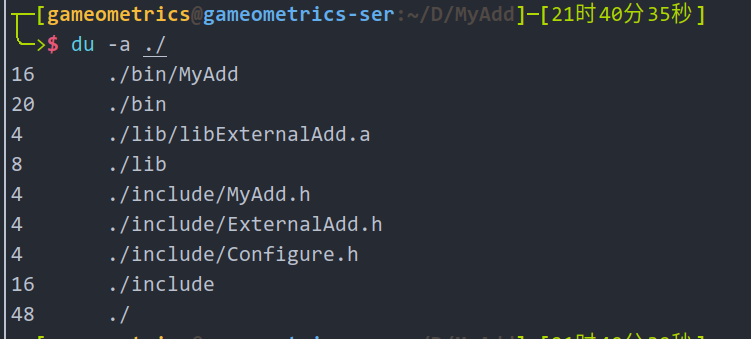

这样就完成了对项目的安装了，就目前而言，我用到的`CMake`的作用阶段就是在我们写代码的时候进行配置、编译和运行，使轻量化的编辑器`VScode`、`LunarVim`等能够代替类似`Visual Studio`等重量级的IDE。


就我目前，作为一个小白新手的使用体验而言，在代码编写方面，简单项目没有体验出明显差别，当然也是从来没有做过复杂项目的原因。

>其实无论在什么阶段，无论你是学院派、理论派还是实干派，C++、Python还是其他编程语言对于绝大多数人而言，只是用来实现功能的一个工具而已，就像CMake，也都是工具而已，不要沉迷于工具而忘记了使用工具的目的(观看B站某视频骂战有感)。


### 3.2 cpack
现阶段不要对`cpack`抱有太高的期待，目前自带的打包，也只是压缩打包而已，更多的打包需要下载对应的打包工具，那还不如用其他更好的工具进行。不同的平台都具有各自的优秀、好用的打包工具。

>择其善者而从之到哪里都是对的。

`cpack`只是最简单的代码进行了实验，只需要在项目根目录内的`CMakeLists.txt`中添加以下内容
```cmake
include(InstallRequiredSystemLibraries)
set(CPACK_PACKAGE_VERSION_MAJOR "${PROJECT_VERSION_MAJOR}")
set(CPACK_PACKAGE_VERSION_MINOR "${PROJECT_VERSION_MINOR}")
set(CPACK_GENERATOR "TXZ")
include(CPack)
```
这里只对最简单的打包情况进行实验，如果想要实验更多的`Generator`，可以参考<https://cmake.org/cmake/help/latest/manual/cpack-generators.7.html>或者搜索更多的中文教程，这个方面的东西还是挺多的。

在上述内容添加以后，需要重新`configure`、`build`、`install`，并在`shell`中输入`cpack`就会根据项目安装内容进行打包。最后会生成`sh`文件以及一个`tar.xz`文件，其中压缩文件内容如下所示。
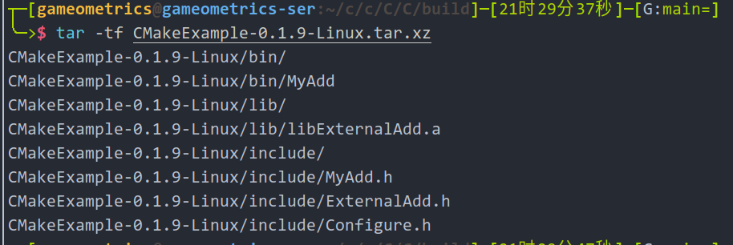

到这里`CMake`的不正经教程关于解释的部分真的就算是结束了，本教程作为新手经验分享，起`教程`这个名字其实就有点哗众取宠的感觉了，分享的还是最原来的目的就是记录提醒自己，帮助小白可以更快速的入门。

>99.99%的人不会和你比较谁更了解C++怎么编译的，他们更关心的是你用它做了什么？

>作为拿来主义的一员，实现功能时没有遇到实际问题的时候，我绝对不会更深入的去了解更深一步的知识，因为每一步都有可能是万丈深渊。

>一个人妄想撼动当前的知识体系就是蚍蜉撼树。

## 4 CMake综合练习
两个样例作为练习，锻炼一下自己学到的东西：

>1. 根据[Learn OpenGL](https://learnopengl-cn.github.io/01%20Getting%20started/02%20Creating%20a%20window)网站的介绍，自己编写`CMakeLists.txt`完成项目构建，并运行第一个[样例](https://learnopengl.com/code_viewer_gh.php?code=src/1.getting_started/2.2.hello_triangle_indexed/hello_triangle_indexed.cpp)。

>2. 编译[ImGui](https://github.com/ocornut/imgui/tree/docking)中基于[GLFW](https://github.com/glfw/glfw)和[VULKAN](https://vulkan.lunarg.com/sdk/home)的样例程序，并能够成功运行。 

>如果这一部分你想要使用我的源码运行，记得在`clone`时添加上`--recursive`的命令。

### 4.1 编译`GLFW`和`GLAD`并运行样例
本部分将首先添加`GLFW`以及`GLAD`的环境，然后编写`CMakeLists.txt`，你可以参考我B站的视频。

我们首先创建`CMakeExcercise`项目，最好使用`CMake`插件自带的功能创建一个新的项目，然后在项目根目录创建`src`文件夹存放本项目的代码以及`external`文件夹，来存放来自于外部的库。然后下载[样例代码](https://learnopengl.com/code_viewer_gh.php?code=src/1.getting_started/2.2.hello_triangle_indexed/hello_triangle_indexed.cpp)并放置在`src`文件夹内并重命名为`OpenGLDemo.cpp`。

上述文件创建完毕后，使用`git`命令对我们的项目进行初始化。
```bash
git init . ##根目录执行
```
#### 4.1.1 添加`GLFW`依赖
为了更好的对依赖环境进行管理以及更新，使用以下命令添加`GLFW`库，对于稳定更新、有远程仓库的开源库都可以使用相同的方法进行。
```bash
git submodule add https://github.com/glfw/glfw  external/glfw ##注意在根目录执行
```
这样就会把`glfw`远程仓库克隆到我们本地`external/glfw`中，`GLFW`这个库本身也是使用`CMake`进行配置和编译的，也极大的方便了我们的使用。

#### 4.1.2 下载`GLAD` OpenGL Loader
由于`OPENGL`本身只是一个协议，具体实现是由电脑上的显卡程序负责的，因此不存在一个通用的`OPENGL`库，只有各类`loader`的提供者，其中著名的可能包括`GLEW`、`GLAD`等，本教程就是使用`GLAD`作为`OPENGL`的loader。

在[glad](https://glad.dav1d.de/)网站进行如下图的配置，并点击`GENERATE`，将生成的`glad.zip`加压到项目`external/glad`目录内。
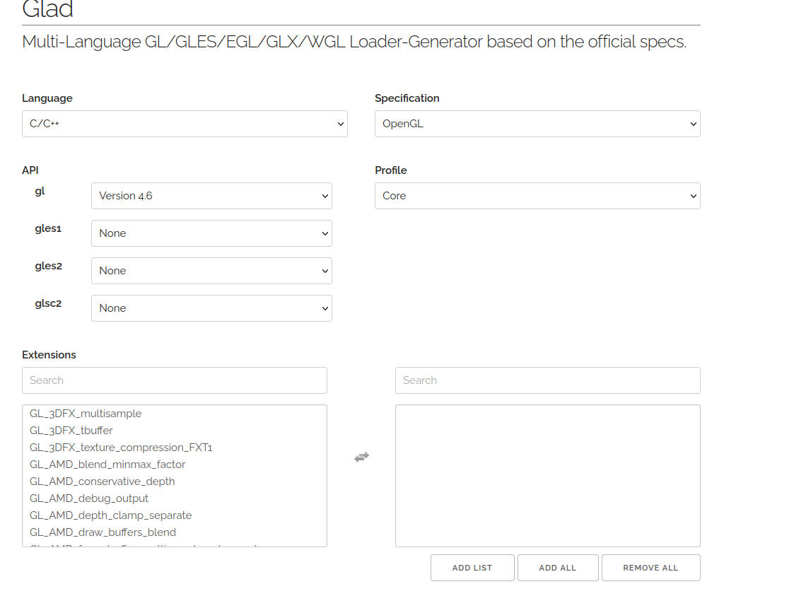

下载的文件也十分简单，包括了`include`以及`src`文件夹两个文件夹，我们项目只需要将`include`路径添加到`include`路径，然后将`src/glad.c`添加进项目内就可以了。

#### 4.1.3 创建练习项目的`CMakeLists.txt`
在编写`CMakeLists.txt`这个文件之前，我们只需要记住最重要的三个要素`include`、`library`、`source`，`CMake`就是要将项目依赖的包的三个东西给指定清楚，我们的项目就可以运行。我们就可以开始在文件中添加以下内容了：
```cmake
cmake_minimum_required(VERSION 3.15) ##指定最低版本

project(CMakeExe LANGUAGES C CXX) ##指定编程语言 我们这里包含了C语言

set(CMAKE_CXX_STANDARD 17) ##指定CXX的标准
set(CMAKE_CXX_STANDARD_REQUIRED ON)

# glad
set(GLAD_DIR ./external/glad)
list(APPEND INCLUDE_DIR ${GLAD_DIR}/include) #GLAD的头文件

# GLFW 
set(GLFW_DIR ./external/glfw)
option(GLFW_BUILD_EXAMPLES "Build the GLFW example programs" OFF) ##GLFW会根据这些OPTION选择编译那些module
option(GLFW_BUILD_TESTS "Build the GLFW test programs" OFF)
option(GLFW_BUILD_DOCS "Build the GLFW documentation" OFF)
option(GLFW_INSTALL "Generate installation target" OFF)
option(GLFW_DOCUMENT_INTERNALS "Include internals in documentation" OFF)

add_subdirectory(${GLFW_DIR} glfw_binary EXCLUDE_FROM_ALL) ##将GLFW引入到我们的项目

list(APPEND INCLUDE_DIR ${GLFW_DIR}/include) #添加GLFW的依赖
list(APPEND INCLUDE_DIR ${GLFW_DIR}/deps) ## 有两个

list(APPEND LINK_LIBS glfw) ##将glfw添加到库

list(APPEND OPENGL_SOURCE ${GLAD_DIR}/src/glad.c src/OpenGLDemo.cpp) ##我们直接将glad.c以及要运行的样例程序进行指定
add_executable(OpenGLDemo ${OPENGL_SOURCE}) 
target_include_directories(OpenGLDemo PUBLIC ${INCLUDE_DIR}) ##将头文件文件夹指定给我们的编译目标
target_link_libraries(OpenGLDemo PUBLIC ${LINK_LIBS}) ## 链接库文件
```
我已经在上述的`CMakeLists.txt`进行了详细的批注，整体上就是最简单的cmake结构，指定三要素，需要注意的是`glad`我们没有对其进行单独的编译，所以需要将`gald.c`加入到我们自己的源目录里面。

>如果你想学习更复杂的`CMakeLists.txt`的写法，可以参考`GLFW`的写法。

在完成上述内容填写之后，我们就可以进行`configure`、`select target`、`build`、`run`，然后我们就可以看到最后的结果了。


如果你想学习更多的`opengl`的相关知识，推荐[Learn OpenGL](https://learnopengl-cn.github.io/)

### 4.2 编译基于`GLFW`+`VULKAN`的`ImGui`样例程序
这个样例我们准备将构建的样例和上一个样例写在同一个`CMakeLists.txt`中，`GLFW`依赖已经配置完毕，现在需要对`vulkan`和`imgui`进行配置。
#### 4.2.1 配置vulkan环境
在上面提供的地址进行下载对应平台的installer，下载安装对于WINDOWS以及MACOS是十分简单，环境变量也是可以自动设置的。Linux的安装包其实是一个压缩包，我们将其解压缩到一个固定的位置，其中我们需要的文件都在`x86_64`文件夹内。

对于Linux而言，在`～/.bashrc`中设置以下变量
```bash
## Vulkan的环境变量
export VULKAN_SDK=/path/to/x86_64 ##你的x86_64路径
export PATH=$PATH:$VULKAN_SDK/bin
export LD_LIBRARY_PATH=$VULKAN_SDK/lib:$LD_LIBRARY_PATH
export VK_LAYER_PATH=$VULKAN_SDK/etc/vulkan/explicit_layer.d
```
重启电脑或者刷新系统可以使用`vkcube`进行测试。
```bash
vkcuke ##测试
```
得到以下旋转的立方体，vulkan就安装成功了：


#### 4.2.2 添加`ImGui`依赖
和`GLFW`一样，我们需要添加的是`submodule`的方式进行添加，在根目录执行以下命令：
```bash
git submodule add -b docking https://github.com/ocornut/imgui.git external/imgui 
```
也就将`imgui`克隆到了`external/imgui`文件中,其中使用`-b`命令选择`clone`的`branch`，IMGUI的`docking`分支增加了`docking space`这个非常好用的功能。

`ImGui`有非常完善的样例，我们首先将其文件夹内的`examples/example_glfw_vulkan`中的`main.cpp`文件拷贝到本项目的`src`文件夹下面，同时你也可以参考它给出的`CMakeLists.txt`的内容。

#### 4.2.3 修改`CMakeLists.txt`
在上一节的`CMakeLists.txt`文件末尾添加以下内容：
```cmake

#GLFW的头文件
list(APPEND IMGUI_INCLUDE_DIR ${GLFW_DIR}/include) 
list(APPEND IMGUI_INCLUDE_DIR ${GLFW_DIR}/deps)

imgui
set(IMGUI_DIR ./external/imgui)
list(APPEND IMGUI_INCLUDE_DIR ${IMGUI_DIR} ${IMGUI_DIR}/backends)

# vulkan
find_package(Vulkan REQUIRED)
list(APPEND LINK_LIBS "Vulkan::Vulkan")

# SOURCE
list(
  APPEND
  IMGUI_SOURCE
  src/main.cpp
  ${IMGUI_DIR}/backends/imgui_impl_glfw.cpp
  ${IMGUI_DIR}/backends/imgui_impl_vulkan.cpp
  ${IMGUI_DIR}/imgui.cpp
  ${IMGUI_DIR}/imgui_draw.cpp
  ${IMGUI_DIR}/imgui_demo.cpp
  ${IMGUI_DIR}/imgui_tables.cpp
  ${IMGUI_DIR}/imgui_widgets.cpp)

add_executable(IMGUI_DEMO ${IMGUI_SOURCE})
target_include_directories(IMGUI_DEMO PUBLIC ${IMGUI_INCLUDE_DIR})
target_link_libraries(IMGUI_DEMO PUBLIC ${LINK_LIBS})
```
这一节比较特殊的一点就是我们使用了一个新的命令`find_package`来查找以及安装的`vulkan`，这个命令可以自动将外部库的头文件进行引入。

`ImGui`也采用了和`glad`相同的配置方式，将头文件引入，并且将其源代码加入到我们自己的项目中，其中`backends`里面有很多文件，我们使用的是`glfw`+`vulkan`两个，所以只需要找到对应的`cpp`文件添加到我们的项目源代码中。

在上述的配置完成以后，我们同样需要`configure`、`select target`、`build`、`run`来编译和配置我们的项目，得到以下结果：
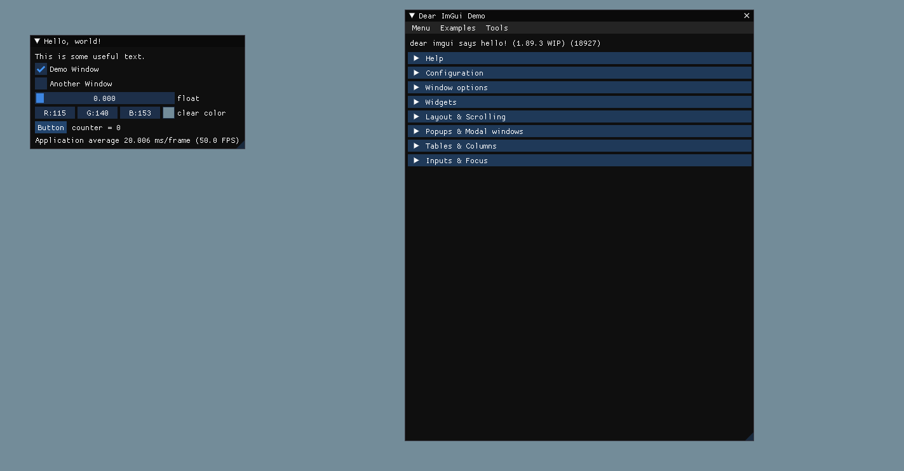

`imgui`能够流行最重要的原因之一可能就是这个十分完善的样例程序了，在我们使用的时候只需要复制对应的代码就可以了。

>复制代码总是十分愉快的。

## 写在最后
我们的`CMake`系列教程到这里就结束了，我大概用了三天的时间完成了整个教程的视频录制、剪辑和教程的编写，其中`WINDOWS`和`MACOS`部分是在整个系列结束后进行的。

整个系列教程的编写让我对`CMake`这个工具有了更深的了解，希望你能够在这个不正经教程中收获你想要的知识，再次感谢能够看到这里，本人`C++`水平有限，只在入门水平，如果对你造成困扰，十分抱歉。

>无论你是谁，你做什么工作，你在什么年龄，在不同渠道获取知识丰富自身，去伪存真，去其糟粕取其精华，是我们在这个信息膨胀的时代的必备能力，希望你能够在我的分享里面捡到你想要的宝石。

代码都是需要自己写才能学会的，收藏再多的视频，买再多的书，你一行也不会写。

>赶紧关注我的B站账号[GAMEOMETRICS](https://space.bilibili.com/282638845)，一键三连吧，来一起写代码吧。

最后的最后的祝福：

>不要和让你成为圣人的人进行争论，也不要和想让你进步的人争论，希望我们都能成为一个明察是非的人。

